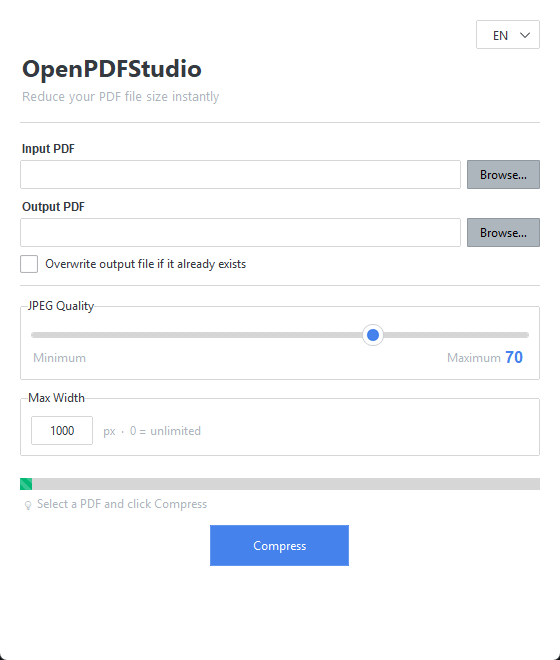

# OpenPDFStudio

<p align="center">
  
</p>

> **A modern open-source toolkit for PDF processing, optimization and automation.**

OpenPDFStudio is an extensible collection of tools for working with PDF documents.
The project is focused on providing fast, lightweight, and automation-friendly utilities that can be used from the command line, integrated into scripts, or embedded into larger workflows.

---

## Features

### Available

- **Compress** — reduce PDF file size by recompressing images with configurable quality and max-width
- **Merge** — combine multiple PDFs into a single document
- **Split** — divide a PDF into individual pages, custom ranges, or every N pages
- **Pages** — reorder, delete, rotate, or extract pages from a PDF
- Cross-platform support (Windows, Linux, macOS)
- CLI-first design with multiple entry points
- Modern GUI with notebook tabs and live language switching (EN/ES)

---

## Installation

```bash
git clone https://github.com/senseiRoa/OpenPDFStudio.git
cd OpenPDFStudio

python -m venv venv
```

### Windows

```bash
venv\Scripts\activate
```

### Linux / macOS

```bash
source venv/bin/activate
```

Install dependencies:

```bash
pip install -r requirements.txt
```

For development mode (entry points available system-wide):

```bash
pip install -e .
```

---

## Usage

### GUI (recommended)

```bash
python compress_gui.py
```

The GUI presents a notebook with four tabs:

| Tab | Description |
|-----|-------------|
| **Compress** | Reduce PDF size with quality and max-width controls |
| **Merge** | Add multiple PDFs, reorder them, and merge into one |
| **Split** | Split into all pages, custom ranges, or every N pages |
| **Pages** | Reorder, delete, rotate, or extract pages |

Language switching (EN/ES) is available in the top-right corner.

### CLI — Compress

```bash
python compress_pdf.py document.pdf
python compress_pdf.py document.pdf --quality 45
python compress_pdf.py document.pdf --max-width 1600
python compress_pdf.py document.pdf --overwrite
python compress_pdf.py document.pdf --verbose
```

### CLI — Merge

```bash
python merge_pdf.py parte1.pdf parte2.pdf parte3.pdf
python merge_pdf.py *.pdf -o completo.pdf
python merge_pdf.py a.pdf b.pdf --overwrite
```

### CLI — Split

```bash
python split_pdf.py documento.pdf
python split_pdf.py documento.pdf --pages 1-5,6-10,11-15
python split_pdf.py documento.pdf --every 3 -o capitulo
```

### CLI — Pages

```bash
python pages_pdf.py documento.pdf --reorder reverse
python pages_pdf.py documento.pdf --reorder 3,1,2,4
python pages_pdf.py documento.pdf --delete 2,5,7
python pages_pdf.py documento.pdf --rotate 90 --pages 1,3,5
python pages_pdf.py documento.pdf --extract 2,4,6 -o seleccion.pdf
```

### Entry points (when installed with `pip install -e .`)

```bash
compress-pdf document.pdf
merge-pdf a.pdf b.pdf
split-pdf doc.pdf --pages 1-5,6-10
pages-pdf doc.pdf --reorder reverse
openpdfstudio-gui
```

---

## Philosophy

OpenPDFStudio follows a few simple principles:

- **Open Source** — forever free and transparent
- **Cross-platform** — Windows, Linux, macOS
- **Fast** — optimized for performance
- **Lightweight** — minimal dependencies
- **Easy to automate** — CLI-first design
- **Modular architecture** — extensible by design
- **Community-driven** — built for and by the community

---

## Roadmap

### Version 1.x ✅

- PDF Compression
- Performance improvements
- Better image optimization

### Version 2.x ✅

- Merge PDFs
- Split PDFs
- Page operations (reorder, delete, rotate, extract)

### Version 3.x

- OCR
- Markdown conversion
- Image extraction
- Metadata editor

### Version 4.x

- REST API
- Docker image
- Python SDK
- MCP Server
- AI workflow integration

---

## Contributing

Contributions are welcome.

If you have ideas, improvements, or bug fixes, feel free to open an Issue or submit a Pull Request.

---

## License

Apache License 2.0

---

## Vision

Our vision is to make OpenPDFStudio one of the leading open-source PDF toolkits for developers, automation engineers, AI platforms, and technical users.

Instead of being a single-purpose utility, OpenPDFStudio aims to become a complete ecosystem for PDF processing that is easy to use, easy to extend, and free for everyone.
